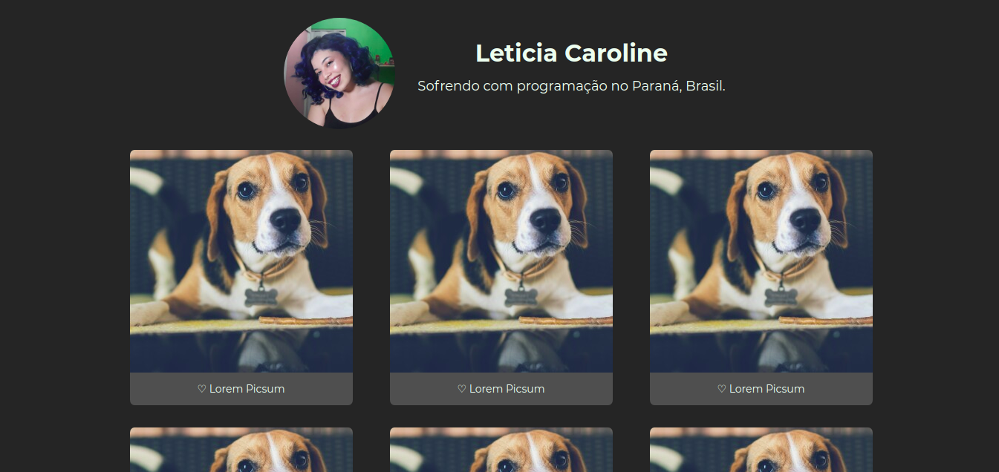

  

<h1 align="center">Photo Grid</h1>

### :pencil2: Sobre o projeto
Esse é um desafio da [WoMakersCode](https://womakerscode.org/) para as pessoas iniciantes em HTML e CSS. Você pode conferir mais detalhes sobre o desafio [aqui](https://github.com/WoMakersCode/challenges-front-end/issues/6) e acessar a minha resolução [aqui](https://levxyca.github.io/photogrid/).

### :computer: Tecnologias utilizadas
- Conceitos de Mobile First
- HTML
- CSS with Flexbox
-------------------------------------------------------

Feito com :hearts: por <a href="https://github.com/levxyca">Leticia Caroline Leonardo</a>
